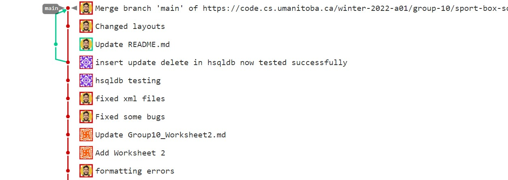

Iteration 1 Worksheet
=====================

Adding a feature
-----------------
### Feature:
https://code.cs.umanitoba.ca/winter-2022-a01/group-10/sport-box-score-manager/-/issues/11

The ability to manipulate the scores for each team was added to our project, because it is important to be able to freely add and subtract to the scores of each team. An extra point may be accidentally added by a user and it needs to be reversible in order for the user to correct their mistake. Accurately tracing each team's score is an integral part of this project, we need to have safety measures for when accidents and slips happen.

### User Stories:
https://code.cs.umanitoba.ca/winter-2022-a01/group-10/sport-box-score-manager/-/issues/4

As mentioned before, accurate tracking of scores is very important for this project. Mistakes and and user errors can and will happen. There needs to be safety measures for the user to undo their actions so that they can resume to what they were doing.

It would be easy for the user to have a visual button when adding or subtracting scores, on our project, the buttons are clearly indicated.

Exceptional code
----------------

Provide a link to a test of exceptional code. In a few sentences,
provide an explanation of why the exception is handled or thrown
in the code you are testing.

Branching
----------

From the vision statement, our branching strategy would be each developer will have their own branch to make some changes and add some features and user stories. We then test and make sure that those features are functional before merging that branch into the main branch and test it again to make sure that everything is still functioning properly. 

The image above shows our branching strategy in action. We each have our own branch and then add user stories and features into our own branch then merge it into the main branch (the red line).

SOLID
-----

Find a SOLID violation in the project of group `(n%16)+1` (group 16 does group 1).
Open an issue in their project with the violation,
clearly explaining the SOLID violation - specifying the type, provide a link to that issue. Be sure
your links in the issues are to **specific commits** (not to `main`, or `develop` as those will be changed).

Provide a link to the issue you created here.

Agile Planning
--------------

Write a paragraph about any plans that were changed. Did you
'push' any features to iteration 2? Did you change the description
of any Features or User Stories? Have links to any changed or pushed Features
or User Stories.
